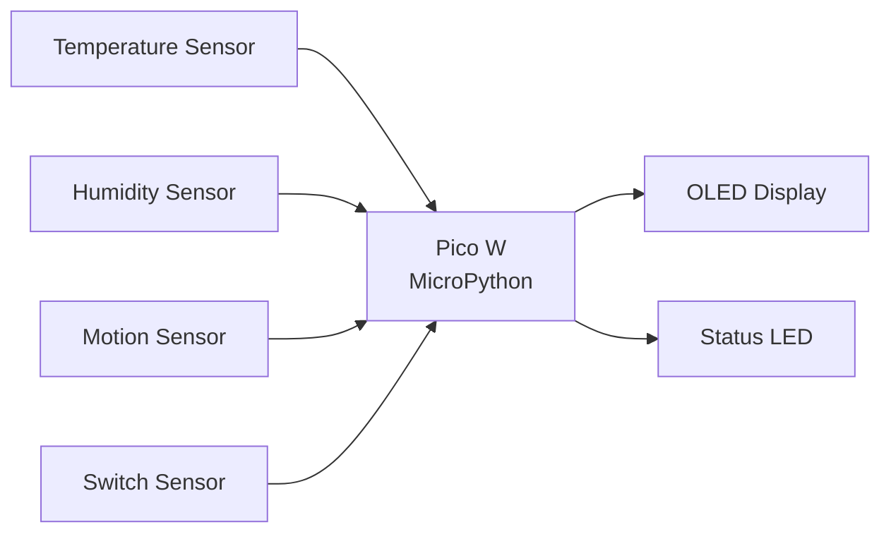
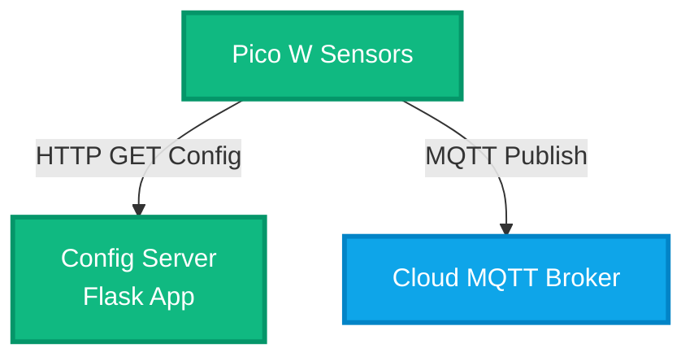
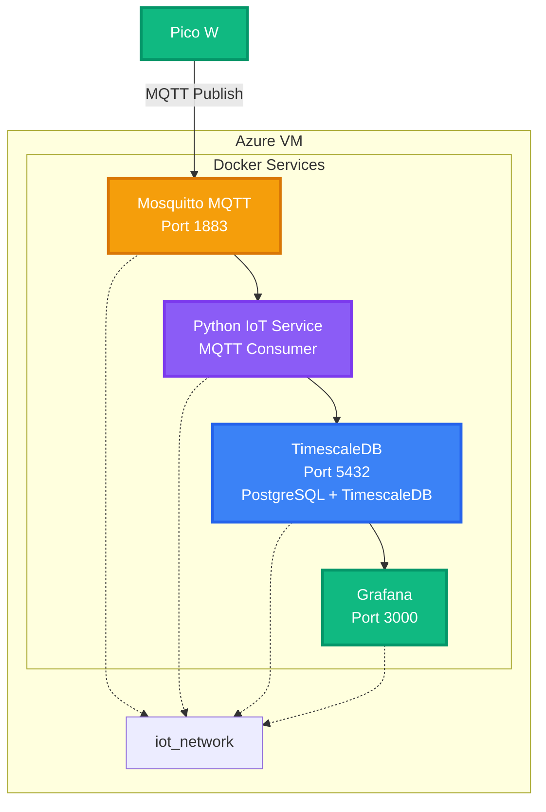
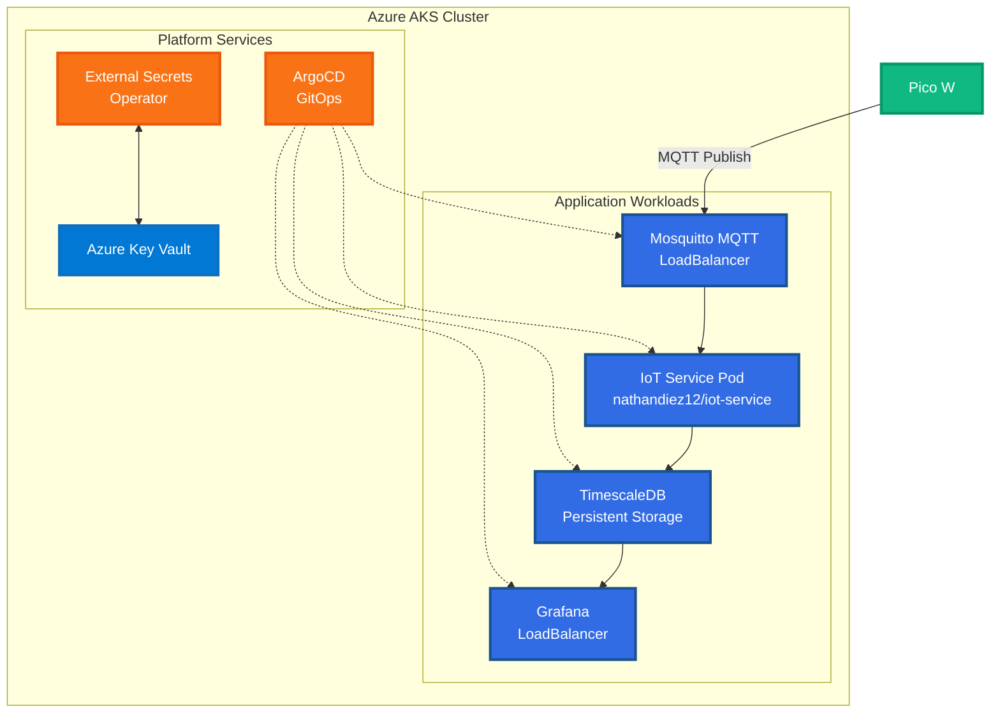
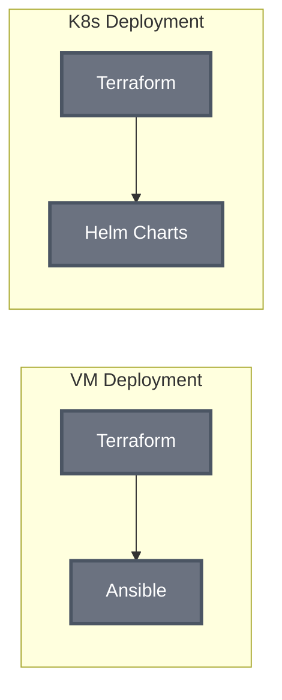
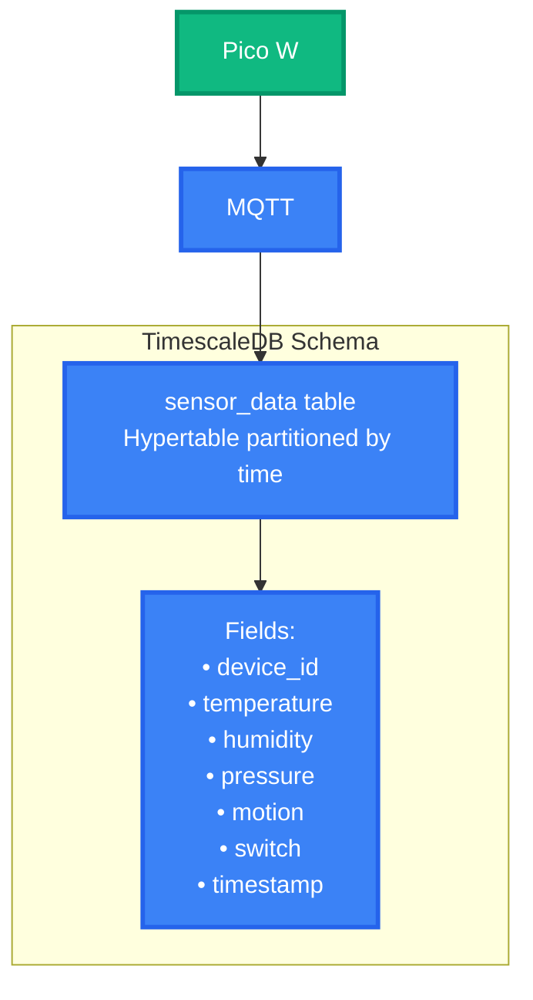

# IoT System Architecture

## Sensor Hardware

```mermaid
graph LR
  TEMP["Temperature Sensor"] --> PICO["Pico W<br/>MicroPython"]
  HUMID["Humidity Sensor"] --> PICO
  MOTION["Motion Sensor"] --> PICO
  SWITCH["Switch Sensor"] --> PICO
  PICO --> OLED["OLED Display"]
  PICO --> LED["Status LED"]
```

## Network & Data Flow

```mermaid
graph TB
  PICO["Pico W Sensors"] 
  CONFIG["Config Server<br/>Flask App"]
  
  PICO -->|"HTTP GET Config"| CONFIG
  PICO -->|"MQTT Publish"| MQTT_CLOUD["Cloud MQTT Broker"]
  
  classDef device fill:#10b981,stroke:#059669,stroke-width:3px,color:#fff
  classDef cloud fill:#0ea5e9,stroke:#0284c7,stroke-width:3px,color:#fff
  
  class PICO,CONFIG device
  class MQTT_CLOUD cloud
```

## Deployment Option 1: Single VM

```mermaid
graph TB
  PICO_VM["Pico W"] 
  
  subgraph "Azure VM"
    subgraph "Docker Services"
      MQTT["Mosquitto MQTT<br/>Port 1883"]
      DB["TimescaleDB<br/>Port 5432<br/>PostgreSQL + TimescaleDB"]
      SERVICE["Python IoT Service<br/>MQTT Consumer"]
      GRAFANA["Grafana<br/>Port 3000"]
    end
    DOCKER_NET["iot_network"]
  end
  
  PICO_VM -->|"MQTT Publish"| MQTT
  MQTT --> SERVICE
  SERVICE --> DB
  DB --> GRAFANA
  
  MQTT -.-> DOCKER_NET
  SERVICE -.-> DOCKER_NET
  DB -.-> DOCKER_NET
  GRAFANA -.-> DOCKER_NET
  
  classDef device fill:#10b981,stroke:#059669,stroke-width:3px,color:#fff
  classDef mqtt fill:#f59e0b,stroke:#d97706,stroke-width:3px,color:#fff
  classDef db fill:#3b82f6,stroke:#2563eb,stroke-width:3px,color:#fff
  classDef service fill:#8b5cf6,stroke:#7c3aed,stroke-width:3px,color:#fff
  classDef viz fill:#10b981,stroke:#059669,stroke-width:3px,color:#fff
  
  class PICO_VM device
  class MQTT mqtt
  class DB db
  class SERVICE service
  class GRAFANA viz
```

## Deployment Option 2: Kubernetes AKS

```mermaid
graph TB
  PICO_K8S["Pico W"]
  
  subgraph "Azure AKS Cluster"
    subgraph "Application Workloads"
      K8S_MQTT["Mosquitto MQTT<br/>LoadBalancer"]
      K8S_DB["TimescaleDB<br/>Persistent Storage"]
      K8S_SERVICE["IoT Service Pod<br/>nathandiez12/iot-service"]
      K8S_GRAFANA["Grafana<br/>LoadBalancer"]
    end
    
    subgraph "Platform Services"
      ARGOCD["ArgoCD<br/>GitOps"]
      EXT_SEC["External Secrets<br/>Operator"]
      KV["Azure Key Vault"]
    end
  end
  
  PICO_K8S -->|"MQTT Publish"| K8S_MQTT
  K8S_MQTT --> K8S_SERVICE
  K8S_SERVICE --> K8S_DB
  K8S_DB --> K8S_GRAFANA
  
  EXT_SEC <--> KV
  ARGOCD -.-> K8S_MQTT
  ARGOCD -.-> K8S_DB
  ARGOCD -.-> K8S_SERVICE
  ARGOCD -.-> K8S_GRAFANA
  
  classDef device fill:#10b981,stroke:#059669,stroke-width:3px,color:#fff
  classDef k8s fill:#326ce5,stroke:#1a5490,stroke-width:3px,color:#fff
  classDef azure fill:#0078d4,stroke:#106ebe,stroke-width:3px,color:#fff
  classDef gitops fill:#f97316,stroke:#ea580c,stroke-width:3px,color:#fff
  
  class PICO_K8S device
  class K8S_MQTT,K8S_DB,K8S_SERVICE,K8S_GRAFANA k8s
  class KV azure
  class ARGOCD,EXT_SEC gitops
```

## Infrastructure as Code

```mermaid
graph LR
  subgraph "VM Deployment"
    TF_VM["Terraform"]
    ANSIBLE["Ansible"]
  end
  
  subgraph "K8s Deployment"  
    TF_AKS["Terraform"]
    HELM["Helm Charts"]
  end
  
  TF_VM --> ANSIBLE
  TF_AKS --> HELM
  
  classDef iac fill:#6b7280,stroke:#4b5563,stroke-width:3px,color:#fff
  
  class TF_VM,TF_AKS,ANSIBLE,HELM iac
```

## Data Schema

```mermaid
graph TB
  PICO_DATA["Pico W"]
  MQTT_MSG["MQTT"]
  
  subgraph "TimescaleDB Schema"
    TABLE["sensor_data table<br/>Hypertable partitioned by time"]
    FIELDS["Fields:<br/>• device_id<br/>• temperature<br/>• humidity<br/>• pressure<br/>• motion<br/>• switch<br/>• timestamp"]
  end
  
  PICO_DATA --> MQTT_MSG
  MQTT_MSG --> TABLE
  TABLE --> FIELDS
  
  classDef device fill:#10b981,stroke:#059669,stroke-width:3px,color:#fff
  classDef data fill:#3b82f6,stroke:#2563eb,stroke-width:3px,color:#fff
  
  class PICO_DATA device
  class MQTT_MSG,TABLE,FIELDS data
```
