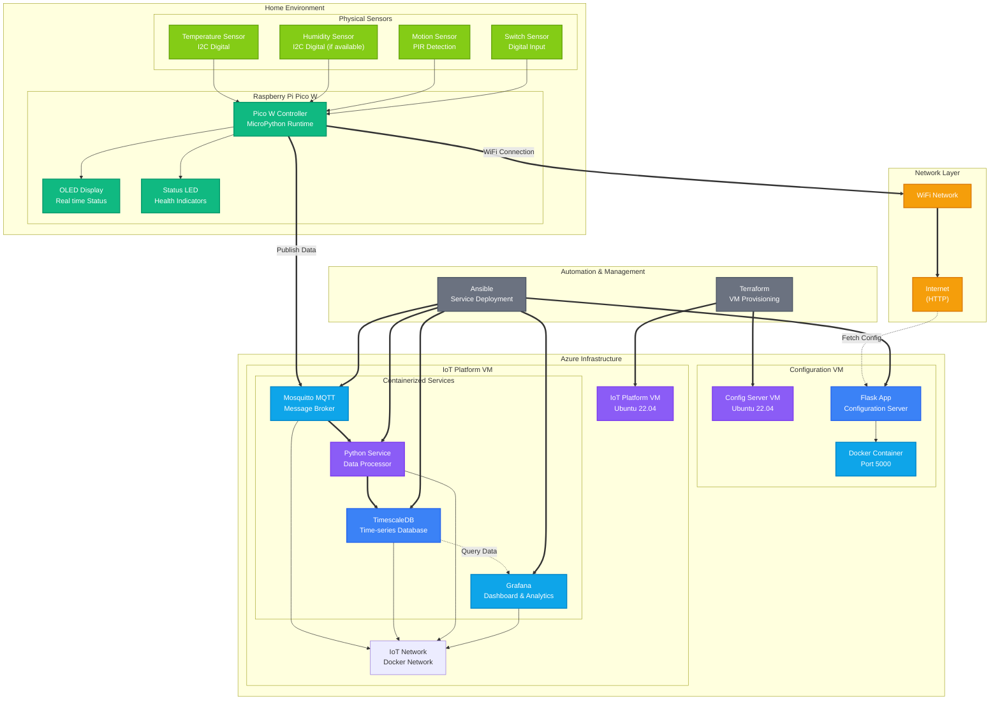

# IoT System Architecture

```mermaid
graph TB
  subgraph "Home Environment"
      subgraph "Physical Sensors"
          TEMP["Temperature Sensor<br/>I2C Digital"]
          HUMID["Humidity Sensor<br/>I2C Digital (if available)"]
          MOTION["Motion Sensor<br/>PIR Detection"]
          SWITCH["Switch Sensor<br/>Digital Input"]
      end
      
      subgraph "Raspberry Pi Pico W"
          PICO["Pico W Controller<br/>MicroPython Runtime"]
          OLED["OLED Display<br/>Real time Status"]
          LED["Status LED<br/>Health Indicators"]
      end
  end
  
  subgraph "Network Layer"
      WIFI["WiFi Network"]
      INTERNET["Internet<br/>(HTTP)"]
  end
  
  subgraph "Azure Infrastructure"
      subgraph "Configuration VM"
          CONFIG_VM["Config Server VM<br/>Ubuntu 22.04"]
          FLASK["Flask App<br/>Configuration Server"]
          DOCKER_CONFIG["Docker Container<br/>Port 5000"]
      end
      
      subgraph "IoT Platform VM"
          IOT_VM["IoT Platform VM<br/>Ubuntu 22.04"]
          subgraph "Containerized Services"
              MQTT["Mosquitto MQTT<br/>Message Broker"]
              TIMESCALE["TimescaleDB<br/>Time-series Database"]
              IOT_SERVICE["Python Service<br/>Data Processor"]
              GRAFANA["Grafana<br/>Dashboard & Analytics"]
          end
          DOCKER_NET["IoT Network<br/>Docker Network"]
      end
  end
  
  subgraph "Automation & Management"
      TERRAFORM["Terraform<br/>VM Provisioning"]
      ANSIBLE["Ansible<br/>Service Deployment"]
  end
  
  %% Data Flow Connections
  TEMP --> PICO
  HUMID --> PICO
  MOTION --> PICO
  SWITCH --> PICO
  PICO --> OLED
  PICO --> LED
  
  PICO ==>|"WiFi Connection"| WIFI
  WIFI ==> INTERNET
  
  INTERNET -.->|"Fetch Config"| FLASK
  PICO ==>|"Publish Data"| MQTT
  
  MQTT ==> IOT_SERVICE
  IOT_SERVICE ==> TIMESCALE
  TIMESCALE -.->|"Query Data"| GRAFANA
  
  FLASK --> DOCKER_CONFIG
  MQTT --> DOCKER_NET
  TIMESCALE --> DOCKER_NET
  IOT_SERVICE --> DOCKER_NET
  GRAFANA --> DOCKER_NET
  
  TERRAFORM ==> CONFIG_VM
  TERRAFORM ==> IOT_VM
  ANSIBLE ==> FLASK
  ANSIBLE ==> MQTT
  ANSIBLE ==> TIMESCALE
  ANSIBLE ==> IOT_SERVICE
  ANSIBLE ==> GRAFANA
  
  %% Styling
  classDef device fill:#10b981,stroke:#059669,stroke-width:2px,color:#fff
  classDef sensor fill:#84cc16,stroke:#65a30d,stroke-width:2px,color:#fff
  classDef network fill:#f59e0b,stroke:#d97706,stroke-width:2px,color:#fff
  classDef storage fill:#3b82f6,stroke:#2563eb,stroke-width:2px,color:#fff
  classDef compute fill:#8b5cf6,stroke:#7c3aed,stroke-width:2px,color:#fff
  classDef infrastructure fill:#6b7280,stroke:#4b5563,stroke-width:2px,color:#fff
  classDef container fill:#0ea5e9,stroke:#0284c7,stroke-width:2px,color:#fff
  
  class PICO,OLED,LED device
  class TEMP,HUMID,MOTION,SWITCH sensor
  class WIFI,INTERNET network
  class TIMESCALE,FLASK storage
  class IOT_VM,CONFIG_VM,IOT_SERVICE compute
  class TERRAFORM,ANSIBLE infrastructure
  class MQTT,DOCKER_CONFIG,GRAFANA container
```
