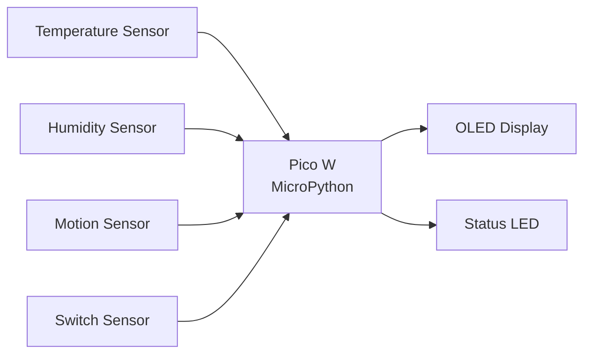
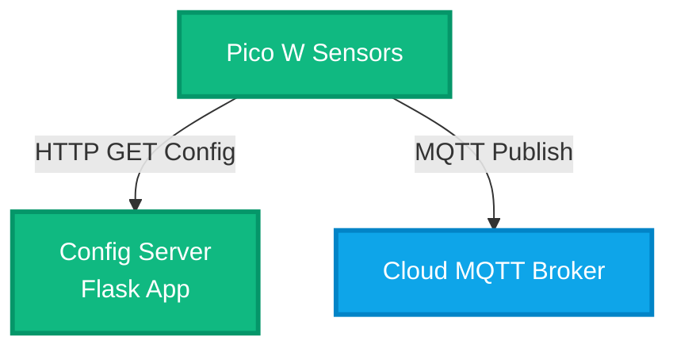
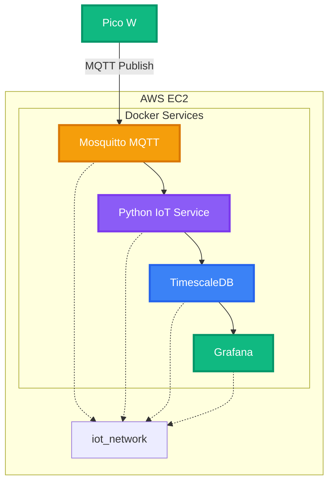
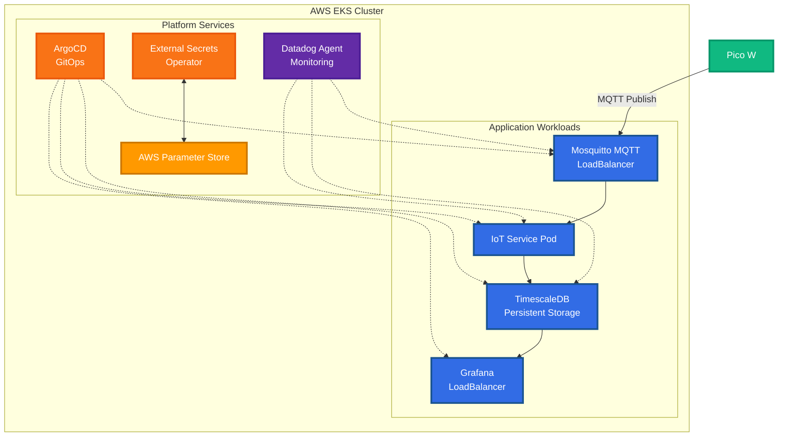
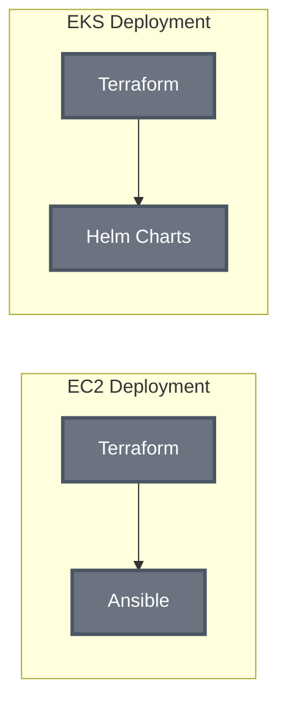
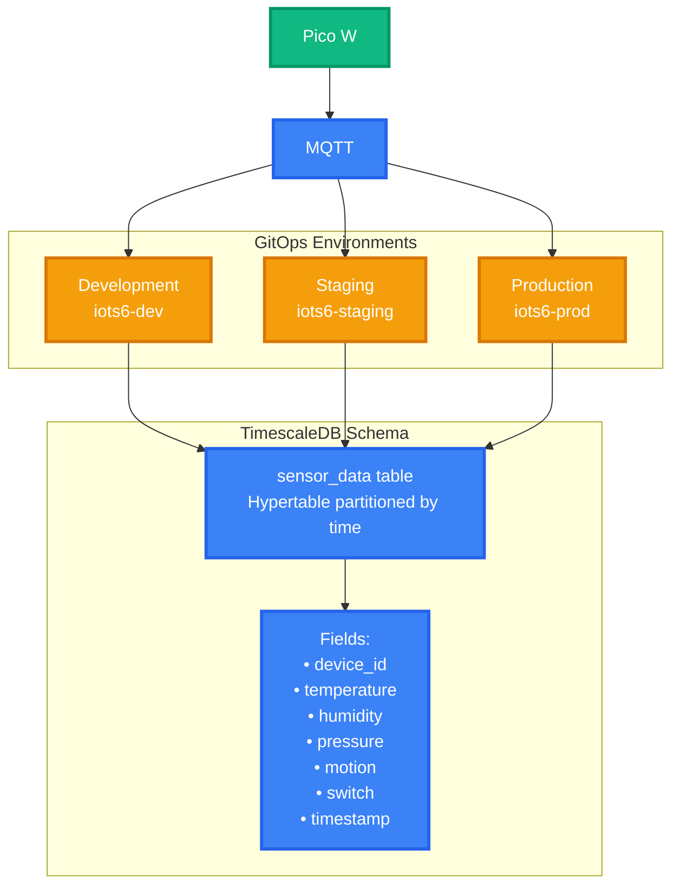
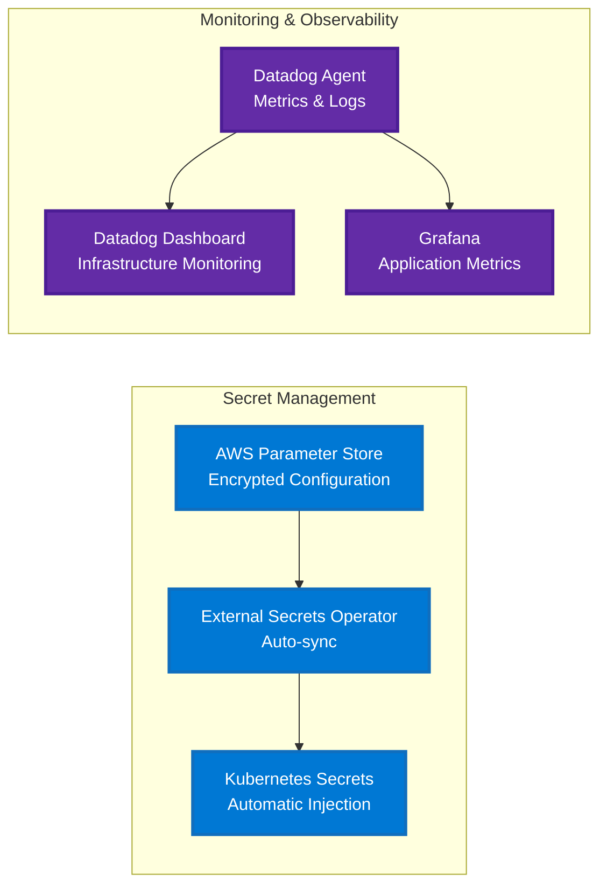

# IoT System Architecture - AWS

## Sensor Hardware

## Network & Data Flow

## VM Deployment

## Deployment Option 2: EKS Kubernetes

## Infrastructure as Code

## Data Schema & GitOps

## Platform Services

